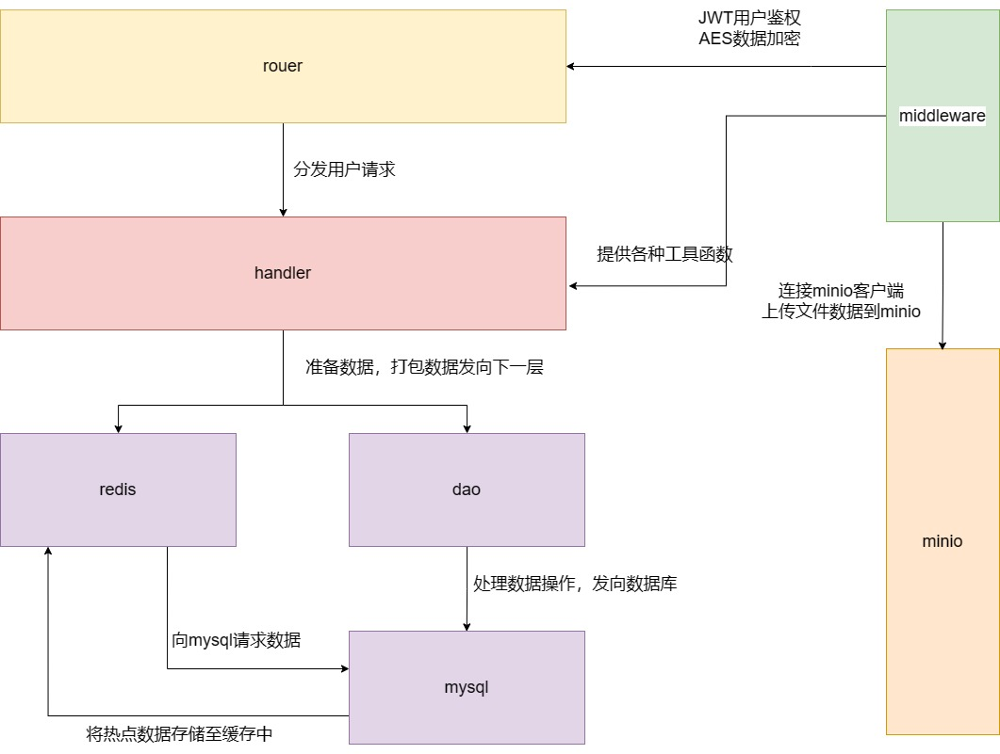

# douyin-demo
抖音项目服务端

## 一、项目介绍
对短视频基本功能进行分析，确定核心功能为视频上传和视频推流，完成初始版本实现用户用户管理、视频发布与推流、用户互动、基本社交等三大模块需求
项目服务地址：
Github  地址：https://github.com/132982317/douyin-demo

## 二、项目分工
|团队成员|主要贡献|
|-------|------|
|骆俊杰|负责开发基础接口，配置minio，部分中间件的编写，文档撰写|
|王昊芮|负责互动接口的开发以及服务器的配置|
|蔡龙祥 |负责数据库配置，配置文件配置，部分社交接口编写|
|楼佳庆|负责部分测试和方法重写，部分中间件的配置等|

## 三、项目实现
3.1 技术选型与相关开发文档

1.使用MySQL存储基本信息，使用minio存储视频信息以便高效地查询和管理，使用redis对热点数据进行监控、存储 
2.使用nginx为网络代理，gin框架完成前后端交互 
3.使用gorm和go-redis为数据操作 
4.使用JWT进行身份验证，AES进行数据加密 
5.使用ffmpeg进行视频转码和处理 
6.限流：  实现令牌桶对用户请求限流，控制系统在单位时间内能够处理的请求量，防止系统过载，并支持突发流量 
7.热点数据检测：  将视频访问请求使用reids中的Sorted Set存储，并定期对Sorted Set进行扫描，对访问量大的数据将其使用redis中的Hash进行存储

当前架构在如果仅作为小范围人群中使用，因部署3台服务器，预计需要10TB存储空间，根据使用人群的数量再对服务器数量和存储空间进行扩充

### 3.2 架构设计
根据需求分析结果，设计整体架构，完成用户、视频、互动、社交等不同模块的解耦设计。

1. 访问，用户通过网络进行访问,使用网络框架桥接前后端，使用路由将请求分流 
2. 处理，在后端对数据进行处理并且打包封装发向用户 
3. 数据操作，使用OMR框架对用户操作进行数据更改 
4. 存储，对于用户信息需要进行可靠性存储，并且需要对视频数据进行对象存储，以保证存储的访问效率 
5. 缓存，对热点数据进行捕获，缓存，减少数据库的压力，提高系统的可用性 
6. 日志，对服务系统进行性能监测以及健康检查 

要解决的问题：

1. 如何存储视频，将视频文件的资源访问率提高？

解决方案：将视频文件存储在分布式对象存储系统中，本项目选用minio，将视频存储在分布式对象存储系统中可以提高视频数据的可靠性、扩展性、性能和管理效率，同时降低存储成本。

2. 网关，缓存，等中间件不可用时如何进行功能降级，保证系统的可用性？

解决方案：部署分布式中间件，监控中间件状态，在部分中间件不可用时自动完成主从切换

3. 对于突发流量应该怎么应对？

解决方案：使用redis储存请求次数，使用令牌桶对请求进行限流处理，桶的容量一开始设置为系统瞬时处理速度的30倍，流速设置为1000次每秒，根据情况进行实时调整

4. 如何保障用户信息的安全？

解决方案：使用jwt对用户身份进行验证，使用AES对用户重要数据进行加密

5. 如何对热点数据进行检测，如何存储热点数据，如何应对热点数据的高发请求？

解决方案：使用redis中的Set对数据请求进行存储，并使用ZREVRANGE命令对Set进行定期扫描，将超过阈值的热点数据使用HASH存储，将视频id作为key，json返回序列为value，用户直接从redis中获取热点视频数据

6. 如何进行视频推流？

解决方案：在项目规模小的时候使用Collaborative Filtering协同过滤推荐算法，当项目规模逐渐增大时对视频贴上tag，并采集数据，进行深度学习，使用Deep Learning Recommendation算法部署

### 3.3 项目代码介绍
项目目录结构：
─config 
├─controller 
├─dal 
├─handler 
│  ├─Comment 
│  ├─Interact 
│  ├─Like 
│  ├─User 
│  └─Video 
├─middleware 
├─minio 
│  └─data 
│      └─.minio.sys 
│          ├─buckets 
│          │  ├─.bloomcycle.bin 
│          │  ├─.usage-cache.bin 
│          │  ├─.usage.json 
│          │  └─douyin 
│          │      ├─.metadata.bin 
│          │      └─.usage-cache.bin 
│          ├─config 
│          │  ├─config.json 
│          │  └─iam 
│          │      └─format.json 
│          └─pool.bin 
├─Model 
├─nginx 
├─public 
├─router 
├─service 
└─test 
1. config 为配置目录，项目的配置基本在config中完成 
2. dal为数据库初始化目录，redis和mysql的相关配置在这里编写 
3. handler为网络框架处理函数，用于处理用户的http请求，并将返回信息序列化成Json字段返回给用户 
4. middleware为中间件层用于存放各种中间件，如AES、FFMPEG、JWT、SNOWFLASK、MINIO等 
5. Model为数据操作层，数据库的初始化，各种数据操作都在这，通过用户行为对数据进行更新 
6. public为临时数据层，将用户上传的视频进行处理后会存放在这里面，随后将文件上传至服务器 

## 四、测试结果 
功能测试：测试用例 ./test/api_test.go

## 五、Demo 演示视频 （必填）

## 六、项目总结与反思 

1. 目前仍存在的问题：对于一些子进程的控制仍然不足

2. 已识别出的优化项：部分功能仍有缺陷，需要优化，下载用户上传视频速度一般，服务器集群尚未搭建完成，视频推流算法还未部署

3. 架构演进的可能性：将服务拆分，设计成微服务架构，提高项目整体的可伸缩性，并且可以提高每个服务的独立性，使得不同服务之间尽可能的不互相影响，增强系统的鲁棒性

4. 项目过程中的总结与反思：在项目开始前应该先集体讨论项目的需求分析，功能细化，项目难点，技术选型，架构设计，预估容量，部署方式，并进行设计评审。这样对于后面的开发工作大家会对项目的功能实现有更清晰的认知，并且在功能合并时可以更好更快地进行整合。
